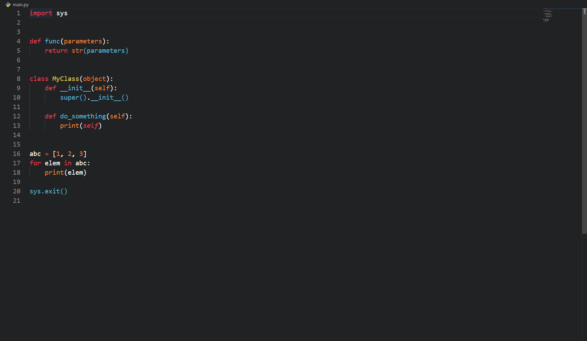

# Monokai's Apprentice

Monokai's Apprentice a VS Code theme that is for old monokai users or people that like dark themes. This theme was based off of monokai and the old hope theme.

# Screenshots

## Python

If you wannt to get rid of the blue parentheses get the brackets colorizer extension and set all the colors to white
so it'll look much nicer.

## C++

## C#

## HTML

## JavaScript

## CSS

